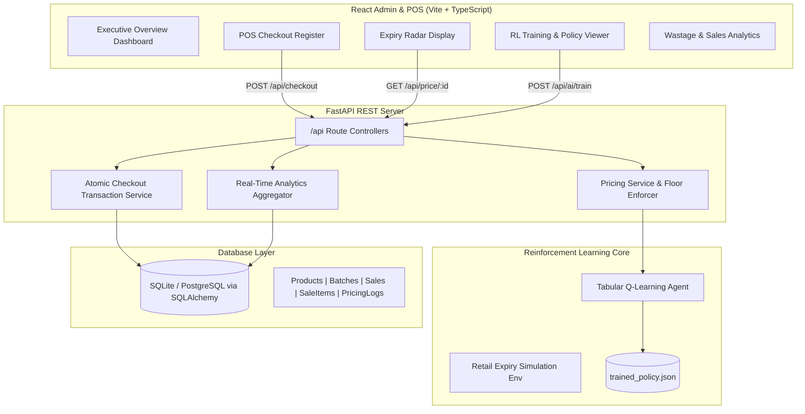
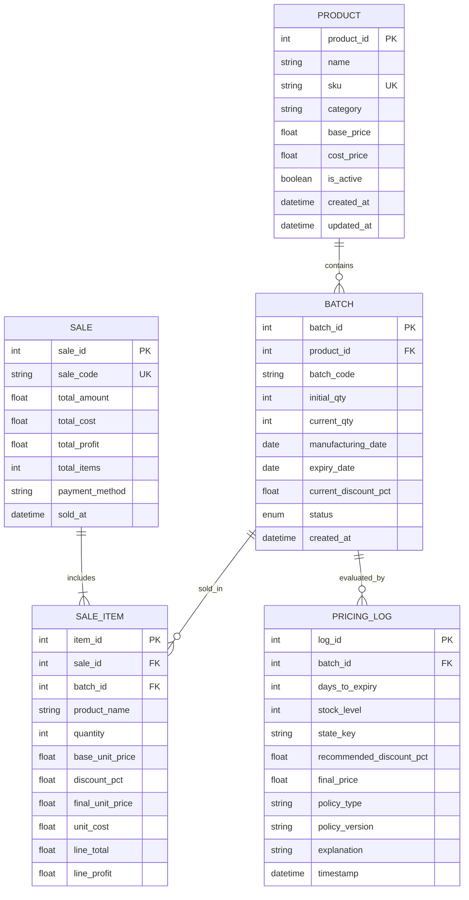
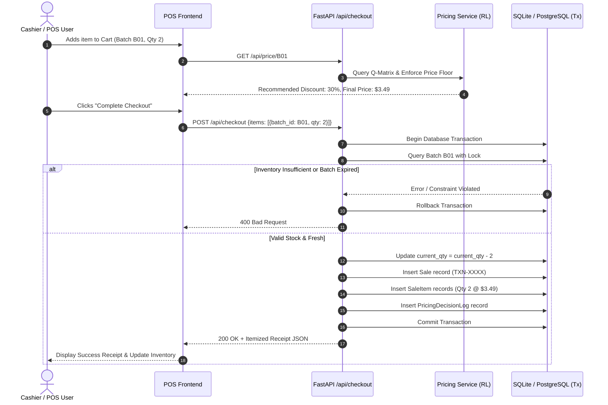

# System Architecture & Diagrams

## 1. System Component Architecture

```mermaid
flowchart TD
    subgraph Frontend["React Admin & POS (Vite + TypeScript)"]
        UI_Dash[Executive Overview Dashboard]
        UI_Radar[Expiry Radar Display]
        UI_POS[POS Checkout Register]
        UI_AI[RL Training & Policy Viewer]
        UI_Analytics[Wastage & Sales Analytics]
    end

    subgraph Backend["FastAPI REST Server"]
        Router["/api Route Controllers"]
        PricingSvc[Pricing Service & Floor Enforcer]
        CheckoutSvc[Atomic Checkout Transaction Service]
        AnalyticsSvc[Real-Time Analytics Aggregator]
    end

    subgraph Intelligence["Reinforcement Learning Core"]
        Env[Retail Expiry Simulation Env]
        Agent[Tabular Q-Learning Agent]
        PolicyJSON[("trained_policy.json")]
    end

    subgraph Storage["Database Layer"]
        DB[(SQLite / PostgreSQL via SQLAlchemy)]
        Tables["Products | Batches | Sales | SaleItems | PricingLogs"]
    end

    UI_POS -->|POST /api/checkout| Router
    UI_Radar -->|GET /api/price/:id| Router
    UI_AI -->|POST /api/ai/train| Router

    Router --> PricingSvc
    Router --> CheckoutSvc
    Router --> AnalyticsSvc

    PricingSvc --> Agent
    Agent --> PolicyJSON
    CheckoutSvc --> DB
    AnalyticsSvc --> DB
```

---

## 2. Database Entity Relationship (ER) Diagram

```mermaid
erDiagram
    PRODUCT ||--o{ BATCH : contains
    BATCH ||--o{ SALE_ITEM : sold_in
    BATCH ||--o{ PRICING_LOG : evaluated_by
    SALE ||--|{ SALE_ITEM : includes

    PRODUCT {
        int product_id PK
        string name
        string sku UK
        string category
        float base_price
        float cost_price
        boolean is_active
        datetime created_at
        datetime updated_at
    }

    BATCH {
        int batch_id PK
        int product_id FK
        string batch_code
        int initial_qty
        int current_qty
        date manufacturing_date
        date expiry_date
        float current_discount_pct
        enum status
        datetime created_at
    }

    SALE {
        int sale_id PK
        string sale_code UK
        float total_amount
        float total_cost
        float total_profit
        int total_items
        string payment_method
        datetime sold_at
    }

    SALE_ITEM {
        int item_id PK
        int sale_id FK
        int batch_id FK
        string product_name
        int quantity
        float base_unit_price
        float discount_pct
        float final_unit_price
        float unit_cost
        float line_total
        float line_profit
    }

    PRICING_LOG {
        int log_id PK
        int batch_id FK
        int days_to_expiry
        int stock_level
        string state_key
        float recommended_discount_pct
        float final_price
        string policy_type
        string policy_version
        string explanation
        datetime timestamp
    }
```

---

## 3. Atomic POS Checkout Sequence Diagram

```mermaid
sequenceDiagram
    autonumber
    actor Cashier as Cashier / POS User
    participant Frontend as POS Frontend
    participant API as FastAPI /api/checkout
    participant Pricing as Pricing Service (RL)
    participant DB as SQLite / PostgreSQL (Tx)

    Cashier->>Frontend: Adds item to Cart (Batch B01, Qty 2)
    Frontend->>API: GET /api/price/B01
    API->>Pricing: Query Q-Matrix & Enforce Price Floor
    Pricing-->>Frontend: Recommended Discount: 30%, Final Price: $3.49
    Cashier->>Frontend: Clicks "Complete Checkout"
    Frontend->>API: POST /api/checkout {items: [{batch_id: B01, qty: 2}]}
    
    API->>DB: Begin Database Transaction
    API->>DB: Query Batch B01 with Lock
    alt Inventory Insufficient or Batch Expired
        DB-->>API: Error / Constraint Violated
        API->>DB: Rollback Transaction
        API-->>Frontend: 400 Bad Request
    else Valid Stock & Fresh
        API->>DB: Update current_qty = current_qty - 2
        API->>DB: Insert Sale record (TXN-XXXX)
        API->>DB: Insert SaleItem records (Qty 2 @ $3.49)
        API->>DB: Insert PricingDecisionLog record
        API->>DB: Commit Transaction
        API-->>Frontend: 200 OK + Itemized Receipt JSON
        Frontend-->>Cashier: Display Success Receipt & Update Inventory
    end
```
